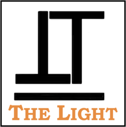

# The Light

*The Light* won [the second prize](https://devpost.com/software/thelight) at [2017 iNTUition Hackathon](http://intuition.ieeentu.com)!
[Demo video](https://youtu.be/93FP2pYaPYI) is available on YouTube.

## Inspiration
Today (15 Oct) is the [White Cane Safety Day](https://en.wikipedia.org/wiki/White_Cane_Safety_Day) which is set to celebrate the achievements of people who are visually impaired. There are over 284 million people who are experiencing vision loss worldwidely, where over 39 million people are completely blind. The loss of visual capabilities limited them from moving independently. They need the help of other people or assistance of guide dogs. However these assistances induce high cost.

In order to contribute in building an inclusive society, we aim to help them through applying our specialization. We feel it's a good idea to use Artificial Intelligence to help them move around and navigate both indoors and outdoors. The technology can be easily exploited on portable devices such as mobile, which can be cheap and easy to use.

## What it Does
*The Light* have two functions.

The first and the most important one is that it helps blind people navigate and move around both indoors and outdoors by avoiding obstacles.

Secondly, it can detect and classify the objects surrounding them. 

## How we Built it
We are using [Tensorflow](https://www.tensorflow.org) as our deep learning framework.

### Navigation Model
We used an image semantic segmentation model to detect the obstacles in a video stream. 

Image semantic segmentation is a computer vision task that gives each pixel a label. The model we used is a state of the art model called [DeepLab](https://arxiv.org/abs/1606.00915). The model is pre-trained [ade20k dataset](http://sceneparsing.csail.mit.edu) with 27 object categories. In order to improve accuracy and reduce redundancy, we modified it to a binary class detection: **clear** or **not clear**. *Clear* means there is no obstacle and is walkable for blind people. In order to give suggestions, we segment the input video frame into three parts: left, center and right. We check whether each part of the frame is clear. At last, our model outputs one label for each of the three parts.

### Object detection Model
As for object detection, we used Single [Shot MultiBox Detector (SSD)](https://arxiv.org/abs/1512.02325) that uses mobileNet model, which is a deep neural network that outputs the position and the label of objects. The model is pre-trained on [Microsoft COCO dataset](http://cocodataset.org) with 80 object categories. 

We will tell the user the object name and its position for each predicted object in audio.

### Audio Generation
We generate a text (suggestion) from the model prediction first then convert the text into audio format.

### Speech Recognition
In order to make it easier to control for blind people, we use the [CMU Sphinx speech recognition engine](https://cmusphinx.github.io) to control the function selection and control in our software.

### GUI Design
We designed a simple yet fully functioning user interface using [PyQt4](https://pypi.python.org/pypi/PyQt4).

## Challenges We Ran Into

### Real Time Processing
The original model takes 40 seconds to run a single image (video snapshot), which makes it impossible to do real time obstacle detection. To handle this, we downsample the input image first before we run the prediction model. Moreover, we improved the software application structure. Instead of doing one snapshot a time, we modify the application to do sequential images prediction, so that the tensorflow session only needs to be loaded and initialized once.

### Audio Generation
It is a bit hard to find a clear and nice voice synthesizer. A pre-recorded audio databases can offer a natural experience, however, it lacks flexibility when existing contents requires modification. We finally decided to use the [Apple audio synthesizer](https://documentation.apple.com/en/logicstudio/instruments/index.html#chapter=A%26section=2%26tasks=true).

### Integration into Application GUI
In order to parallel multiple tasks, including video processing, inference and GUI controlling, we use a multi-threads design. Synchronization between threads is indeed a challenging task, especially when handling the delay caused by inference.

## Accomplishments that We're Proud of

### High Accuracy
We are able to achieve very high accuracy for various scenes. 

The model we used is DeepLab which is the state-of-the-art technology. DeepLab produces almost the currently best result and the original paper is published on TPAMI which is one of the best Journal in Artificial Intelligence.

SSD with MobileNet is also a state-of-the-art architecture for real-time object detection with high accuracy (74~77 mAP).

### Indoor Extension
The original task is only for outdoors scene detection for self-driving cars. Now we are able to extend the model to indoors navigation.

### Real Time
Our software is able to produce live time audio suggestions for camera video with almost no delay. As for the detection, out software can also run in the speed of ~5 fps.

### Easy to Use
Our software is user friendly for blind people since it takes audio for input and provide audio suggestions. It does not require any external assistance.

### Inclusive Design
We are pround that we are able make some contributions to build an inclusive society.

## What We Learned

### Software Design
We learned how to design and build a software from scratch, including the architecture design and the interaction between each components and objects.

### Problem Solving Skills
We enhanced our ability to solve problems. We learnt how to research, gather information and develop solutions efficiently.

### Project Management
We learnt how to manage a project. We started with brain storming, each of us propose some ideas then followed by discussion. Next we finalized our idea and come up with schedules and division of work.

### Collabration Skills and Communication Skills
The most important soft skill we learnt is how to collaberate with teammates and communicate effectively.

## What's Next

### Build on Portable Devices
Currently, the demo is on our laptop. Building it on portable devices will be our next step. It can be built in wearable devices that specially designed for blind people or on mobile devices, such as Android and iOS.

### Integerate with GPS
Our application will be more complete if we can integrate it with GPS which provides a route planner.

### Add More Functionality
We plan to add more funcionalities to our application to make it the only one application that the blind people needs. 

Functionalities that we are considering include currency recoginition, face recognition (recoginize friends and others' facial expression), text to audio tool, scene recogition and video summarization. 
